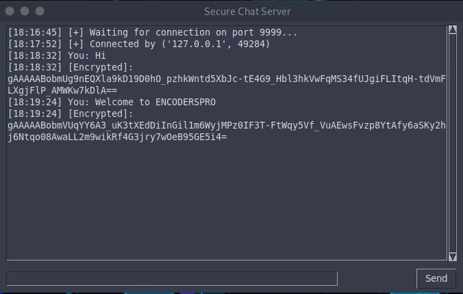

# 🔐 Encrypted Chat App using Python

A secure, real-time chat application built in Python that uses **RSA for key exchange** and **Fernet (AES)** for message encryption. It supports a GUI interface using Tkinter and enables encrypted two-way communication between a client and server.

---

## 📌 Features

- 🔑 **RSA-based key exchange** for secure Fernet key transfer  
- 🛡️ **End-to-end encryption** using Fernet (AES + HMAC)  
- 💬 **Real-time chat** with message timestamps  
- 🧵 **Multithreaded communication** for seamless chat flow  
- 🖼️ **Tkinter GUI** for user-friendly interaction  
- ⚙️ Lightweight and cross-platform (Windows/Linux)

---

## 🧠 How It Works

1. Both client and server generate RSA key pairs.
2. The client sends its public key to the server.
3. The server generates a Fernet key and encrypts it using the client's public key.
4. The client decrypts it using its private key.
5. Messages are then encrypted with the Fernet key and sent securely via sockets.

---

## 🛠️ Technologies Used

- Python 3.x  
- `socket`, `threading`  
- `rsa`, `cryptography` (Fernet)  
- `tkinter` (for GUI)

---

## 🧪 Setup Instructions

### 1. Clone the repo

```bash
git clone https://github.com/hey-raghav/encrypted-chat-app.git
cd encrypted-chat-app
```

### 2. Install dependencies

```bash
pip install rsa cryptography
```

### 3. Run the server

```bash
python3 server.py
```

### 4. Run the client

```bash
python3 client.py
```

Make sure both are running on the same network or use `localhost`.

---

## 📁 Project Structure

```
.
├── client.py               # Client with GUI
├── server.py               # Server with encryption logic
├── encryption.py           # RSA + Fernet key handling
├── rsa_keys/               # Folder to store .pem key files
├── screenshots/            # GUI and exchange screenshots
│   └── screenshot_chat_server_gui.jpeg
├── requirements.txt
└── README.md
```

---

## 🖼️ Screenshots

### 🔐 Secure Chat Server Interface



---

## 🚀 Future Improvements

- ✅ Group chat support  
- ✅ Encrypted file sharing  
- ✅ User login/authentication  
- ✅ Export chat logs securely  

---

## 📜 License

MIT License